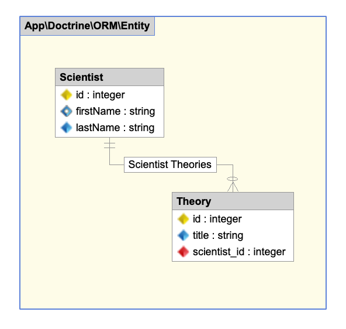

========
Entities
========

The default Doctrine ORM connection comes from
the ``.env`` file: ``DB_CONNECTION``.  Further configuration of a new install
is not necessary to get started.

Unlike Eloquent, Doctrine ORM is **not** an active record pattern, but a
`data-mapper pattern <https://tsh.io/blog/active-record-vs-data-mapper-patterns-in-php/>`_.
Every active record model extends a base class that implements all
the persistent, database, logic.

Entities are objects with identity. Their identity has a conceptual meaning
inside your domain. In an application, each theory has a unique id. You can
uniquely identify each theory by that id.

Doctrine entities don't extend any class, they are just plain PHP classes
with properties (and, historically, getters and setters).
Historically, the properties are protected or private, so they only can be accessed
through getters and setters.  However, with property hooks in PHP 8.4, entities
composed of global properties only will become the norm.

.. code-block:: php

  $scientist = new Scientist();
  $scientist->firstName = 'Albert';
  $scientist->lastName  = 'Einstein';

  $theory = new Theory();
  $theory->title = 'Theory of Relativity';
  $theory->scientist = $scientist;

  $scientist->theories->add($theory);

  EntityManager::persist($scientist);
  EntityManager::persist($theory);
  EntityManager::flush();

In Doctrine ORM, the domain and business logic is completely separated from
the persistence logic.  This means we have to tell Doctrine how it should map
the columns from the  database to our Entity class.
In this example we are using attributes.  Another possibility is XML.

.. note::

  There used to be more ways to define your metadata in Doctrine ORM, but
  time has shown the only options of Attributes and XML are necessary.

Relations are of type ``Doctrine\Common\Collections\Collection``.  When writing
an entity, you should assign an empty collection property to a new
``Doctrine\Common\Collections\ArrayCollection``.
You can easily add on new relations with ``->add()``, remove them with
``->removeElement()`` or check if the relation is already defined with
``->contains()``

The ``Scientist`` entity, used in the example above, looks like this when using
attributes for the metadata.

.. code-block:: php

  use Doctrine\ORM\Mapping as ORM;
  use Doctrine\Common\Collections\ArrayCollection;
  use Doctrine\Common\Collections\Collection;

  #[ORM\Entity(repositoryClass: "App\Doctrine\ORM\Repository\ScientistRepository")]
  class Scientist
  {
      #[ORM\Id]
      #[ORM\Column(type: "integer")]
      #[ORM\GeneratedValue(strategy: "AUTO")]
      private int $id;

      #[ORM\Column(type: "string", nullable: false)]
      private string $firstName;

      #[ORM\Column(type: "string", nullable: false)]
      private string $lastName;

      #[ORM\OneToMany(targetEntity: Theory::class, mappedBy: "scientist")]
      private Collection $theories;

      public function __construct()
      {
          $this->theories = new ArrayCollection();
      }
  }

The related `Theory` entity looks like this:

.. code-block:: php

  use Doctrine\ORM\Mapping as ORM;

  #[ORM\Entity(repositoryClass: "App\Doctrine\ORM\Repository\TheoryRepository")]
  class Theory
  {
      #[ORM\Id]
      #[ORM\Column(type: "integer")]
      #[ORM\GeneratedValue(strategy: "AUTO")]
      private int $id;

      #[ORM\Column(type: "string", nullable: false)]
      private string $title;

      #[ORM\ManyToOne(targetEntity: Scientist::class, inversedBy: "theories")]
      #[ORM\JoinColumn(name: "scientist_id", referencedColumnName: "id", nullable: false)]
      private Scientist $scientist;
  }

Metadata
========

Because Doctrine entities do not extend any smart ancestor class, we have to tell
Doctrine how to map the data from the database into the entity. There are
multiple ways of doing this.

Attributes
----------

Attributes mean that you will use attributes
to indicate the column mappings.

.. code-block:: php

 namespace App\Doctrine\ORM\Entity;

  use Doctrine\ORM\Mapping as ORM;

  #[ORM\Entity]
  #[ORM\Table(name: "articles")]
  class Article
  {
      #[ORM\Id]
      #[ORM\Column(type: "integer")]
      #[ORM\GeneratedValue(strategy: "AUTO")]
      private $id;

      #[ORM\Column(type: "string", nullable: false)]
      private $title;
  }

More about the attributes driver:
https://www.doctrine-project.org/projects/doctrine-orm/en/2.11/reference/attributes-reference.html

XML
---

Another option are XML mappings. It's better to change the
metadata paths to something like ``config_path('doctrine_orm_metadata')``
for your xml files.

App.Doctrine.ORM.Entity.Article.dcm.xml

.. code-block:: xml

  <?xml version="1.0"?>
  <doctrine-mapping xmlns="http://doctrine-project.org/schemas/orm/doctrine-mapping" xmlns:xsi="http://www.w3.org/2001/XMLSchema-instance" xsi:schemaLocation="http://doctrine-project.org/schemas/orm/doctrine-mapping https://www.doctrine-project.org/schemas/orm/doctrine-mapping.xsd">
    <entity name="App\Doctrine\ORM\Entity\Article" table="articles">
      <id name="id" type="integer">
        <generator strategy="AUTO"/>
      </id>
      <field name="title" type="string" nullable="false"/>
    </entity>
  </doctrine-mapping>

More information about XML mappings:
https://www.doctrine-project.org/projects/doctrine-orm/en/2.6/reference/xml-mapping.html

.. role:: raw-html(raw)
   :format: html

.. include:: footer.rst
